# Pump It Up: Data Mining the Water Table for Tanzanian Water Crisis
* Non-technical slide presentation:https://docs.google.com/presentation/d/1G7arQpIteHzjAdwzKlTUQDZ00-CMDMqLHXytT274Uu4/edit?usp=sharing
* Non-technical video presentation:https://drive.google.com/file/d/1ric6lTB1kCHWBcqOcWpq2qfWaabJkqRW/view?usp=sharing
----------------------------------------------------------
## Predicting water pump functionality  for water pumps in Tanzania
----------------------------------------------------------
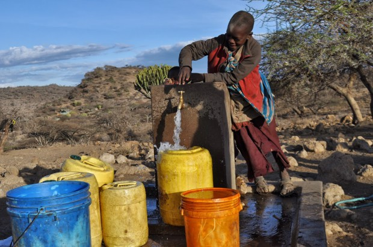
Children collect water in Uwiro Village, Tanzania. (credit: Tom Murphy) [Source](https://www.humanosphere.org/world-politics/2014/12/tanzania-failed-fix-water-access-problem/)
## Goals and Overview
Tanzania is a country on the Eastern coast of Africa who hashistorically suffered from high water demand  for it's people. As they are a developing country, they have been the recipients of many different humanitarian efforts. Over time, many waterpoints  have been established across the country. Overtime, a portion of these waterpumps are now not functioning or in need of repair. Using data provided by Taarifa and the Tanzanian Ministry of Water, the goal is to construct a model that will be able to predict which pumps are functional, which need some repairs, and which don't work at all. 

# Preprocessing The Data
To properly work with the data and explore, I first cleaned the dataset by checking for duplicates, which there were none of, and then dealing with the missing values.

## Columns and descriptions
These column name and descriptions were pulled from the  problem description on [datadriven.org](https://www.drivendata.org/competitions/7/pump-it-up-data-mining-the-water-table/page/23/) which currently hosts this data.

* amount_tsh - Total static head (amount water available to waterpoint)
* date_recorded - The date the row was entered
* funder - Who funded the well
* gps_height - Altitude of the well
* installer - Organization that installed the well
* longitude - GPS coordinate
* latitude - GPS coordinate
* wpt_name - Name of the waterpoint if there is one
* num_private -
* basin - Geographic water basin
* subvillage - Geographic location
* region - Geographic location
* region_code - Geographic location (coded)
* district_code - Geographic location (coded)
* lga - Geographic location
* ward - Geographic location
* population - Population around the well
* public_meeting - True/False
* recorded_by - Group entering this row of data
* scheme_management - Who operates the waterpoint
* scheme_name - Who operates the waterpoint
* permit - If the waterpoint is permitted
* construction_year - Year the waterpoint was constructed
* extraction_type - The kind of extraction the waterpoint uses
* extraction_type_group - The kind of extraction the waterpoint uses
* extraction_type_class - The kind of extraction the waterpoint uses
* management - How the waterpoint is managed
* management_group - How the waterpoint is managed
* payment - What the water costs
* payment_type - What the water costs
* water_quality - The quality of the water
* quality_group - The quality of the water
* quantity - The quantity of water
* quantity_group - The quantity of water
* source - The source of the water
* source_type - The source of the water
* source_class - The source of the water
* waterpoint_type - The kind of waterpoint
* waterpoint_type_group - The kind of waterpoint
### Data cleaning process
I narrowed the features listed within this down by removing redundant or unneccesarily granular features. Since we are not working with deep neural networks or classifiers that highly appreciate granularity, in most cases I stuck with the feature that was highest in hierachical order. For example, between extraction_type, extraction_type_group, and extraction_type_class, extraction_type_class is the least granular of the three, thus I dropped the other two for my model. Many geographic features were present in our data as well. I kept latitude/longitude for they were some of the continuous features that were present, as well as region and basin. I kept both region and basin because region is an anthropogenic geographical differentiator while basin is a hydrological differentiator. Since we are trying to determine functionality of water pumps, I figured this would be best.
### Dealing with NaNs
For most NaN's, I filled in with unknown, however for permit, public_meeting, and construction_year, I used an Iterative Imputer. Iterative Imputation will take in a matrix of features from said dataset and will essentially perform regression on it in order to attempt to determine what the value most likely is. I did this with permit and public meeting because I could simply turn them into boolean 1 and 0. I also did this with construction year as that seemed like a feature I would like to keep in my final model.
```
from sklearn.experimental import enable_iterative_imputer
from sklearn.impute import IterativeImputer
from sklearn.linear_model import BayesianRidge

#These are all the numerical columns within our dataset
columns_for_imputation = ['amount_tsh', 'longitude','latitude','gps_height','population',\
                   'public_meeting','permit']

#Set the min and max value to be 0 and 1, respectively, to match what is in permit and public meeting
iterimputer = IterativeImputer(estimator=BayesianRidge(), min_value =0, max_value =1)

#Our permit and public_meeting values. we round so that they aren't floats
permit_vals = np.round(iterimputer.fit_transform(trainingdata[columns_for_imputation])[:,-1], 0)
pub_meet_vals = np.round(iterimputer.fit_transform(trainingdata[columns_for_imputation])[:,-2], 0)
```
# EDA
After having cleaned the data, I decided to answer some questions that I thought were interesting in getting more familiar with this dataset.
### Identifying Class Imbalance within Dataset
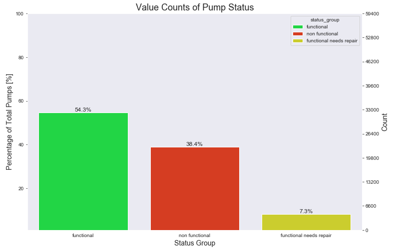

#### Conclusion:
Most definitely there is class imbalance! There is significantly more functional and non functional pumps than there are functional that need repair. I will have to address this during the modeling. If the data is too imbalanced, the model could miss classification of the minority class almost entirely.
### Distribution of Pump Functionality in each Basin

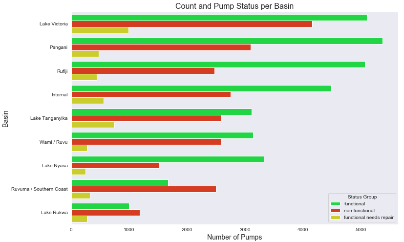

#### Conclusion
Pump functionality and number of pumps available varies greatly across each basin. Some locations dwarf others in numbers of functional pumps. From this graph we can see that two basins in particular appear to be possibly underserved and in more need for water aid and pump repair than others. Those basins are Lake Rukwa and Ruvuma / Southern Coast. Both basins have more non functioning pumps than they do functioning and are the only two basins to reflect this characteristic.
### Population in each Basin

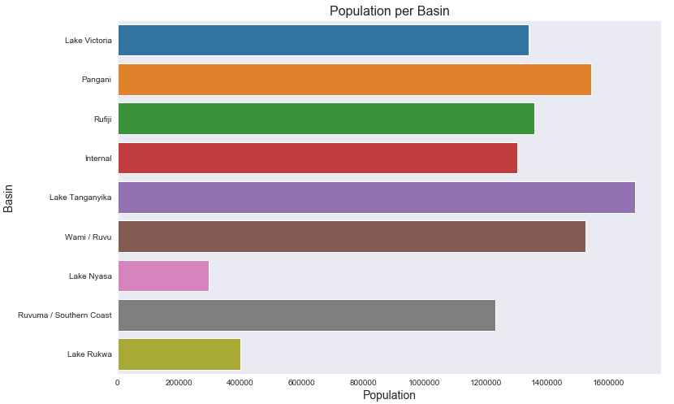

#### Conclusion:
When this graph is cross-referenced with the one above, we can inference that the Tanzanian Water Crisis is possibly strong in Ruvuma/Southern Coast since the location is in second to last for most number of functional pumps. Where possible, I would advise a focus repairing the pumps that can be repaired within that basin to increase the water access of the people living there.
### Relationship between Source Type and Pump Functionality

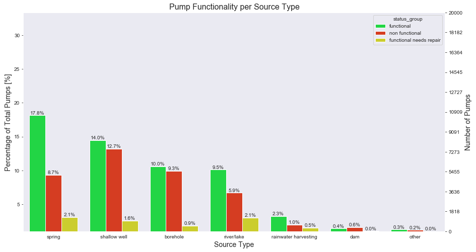

#### Conclusion:
Shallow well and borehole sourced water pumps about evenly match in ratios of functioning pumps to non functioning/need repair pumps. Since both are groundwater methods, it appears that groundwater sources are liable to have less functioning pumps in relation to the number non functioning pumps. Very little water is gathered through other means such as dams, rainwater catchement. It also appears that groundwater sources such as wells and boreholes are less likely to have wells that function but need repair.
### Relationship between Source Type and Water Quantity

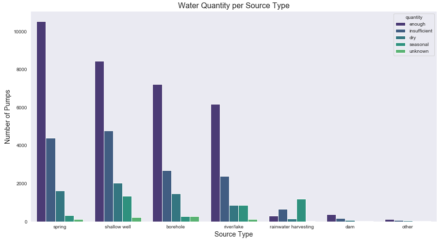

#### Conclusion pt1:
Rainwater harvesting appears to be the most seasonal of all quantity amounts. Spring water is the most common source of water as well as the source with the most number of pumps that provide enough water. Borehole and Shallow well pumps have a higher chance of being dry than pumps that get their water from a spring or river/lake. This chart also suggests that there could be expansion in water infrastructure through increasing the number of dams or amount of rainwater catechement. This also speaks to the seasonality of Tanzania's rainy periods and the potential seasonality within some of these observation recordings.
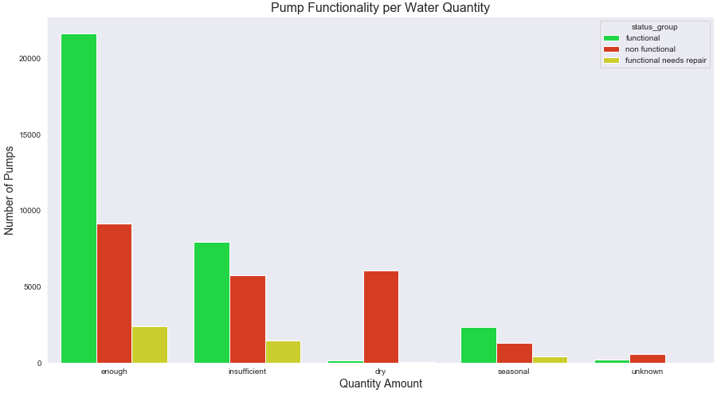
#### Conclusion pt2:
I'm lumping this in with the previous question. The majority of the pumps that are able to provide enough water are also functional. Almost every pump that has now gone dry is classified as non functional. This gives insight into why certain pumps, specifically these, could possible not be working--if a pump has gone dry, it can be considered non functional then. A priority here would be returning to functional and giving the needed repairs to the pumps that provide enough water.
### Relationship Between Water Extraction Type to Water Quanity

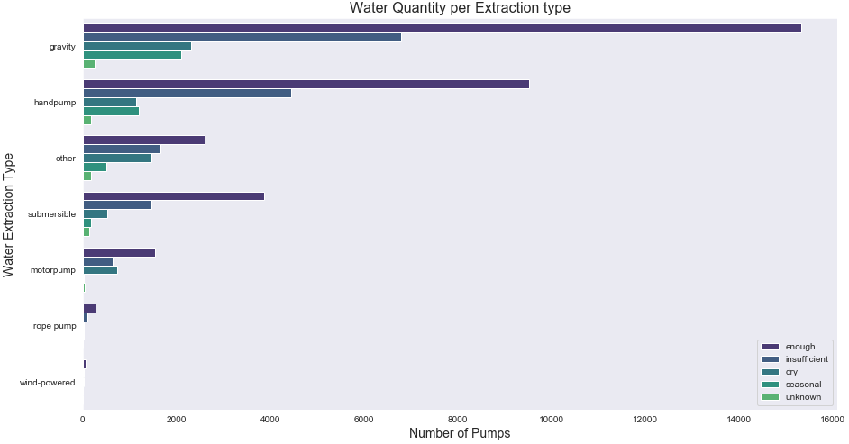

#### Conclusion pt1:
Gravity pumps are providing more water than any other type of pump. Since it appears that the majority of these types of pumps are able to provide enough water,It can be assumed that for both gravity and handpump, all functioning wells are also providing enough water.

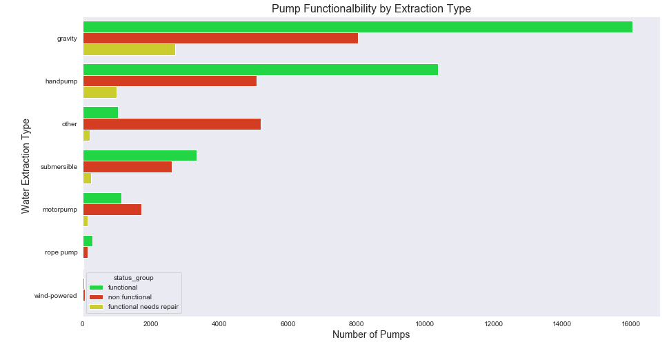

#### Conclusion pt2:
Numbers are similar between graphs and it can be deduced that the majority of functional gravity and handpumps are providing enough water. Pumps that are insufficent have either stopped functioning or are in need of repair. Since gravity pumps appear to be the most prevalent type of pump, as well as the pumps with the most number of functional but in need of repair type of pumps, I would reccomend efforts are place into fixing those existing pumps if it means getting them functional means they will provide enough water for their populations.
# Modeling
For modeling, I split the training data given into a train and test set. the test set given by the competition will be used at a later date. I created four different models: A multi-class Logistic Regression Model, a K-Nearest Neighbors, a Random Forest, as well as gradient boosted trees in the form of XGBoost. In order to deal with the class imbalance issue, I also used synthetic resampling in the form of SMOTE on my data.

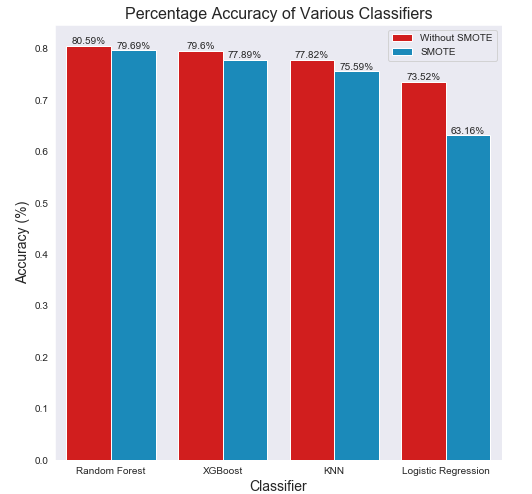

Models performed slightly worse on the test set when fit to the SMOTE-d data, however I did see a higher recall on the minority class, "functional needs repair". In most cases, accuracy on the training set did increase, thus I believe Random Forest and XGBoost were slightly overfitting to the training set. K-Neighbors was very overfit to the training set. In the end, I decided to use the Random Forest model as well as SMOTE-ing the data because it experienced the least amount of decrease in test accuracy and SMOTE-ing helped improve the recall of the minority class. In this problem, we are okay with a functional pump as getting flagged as possibly needing repair, as the eventual goal will be to repair, thus it is helpful to capture more of them than to not.
## Feature importance

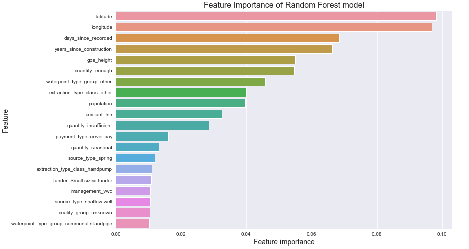

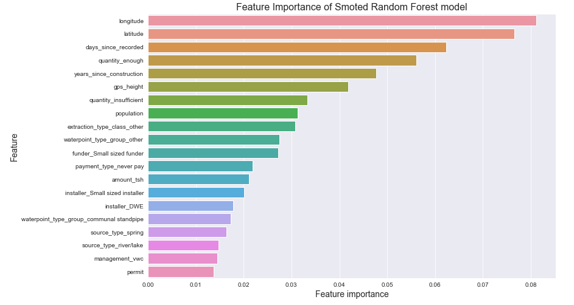

Looks like the most important features within the Random Forest model were the longitude and latitude coordinates. Days since record and since construction proved to be important as well. Certain categories such as quantity-succifient proved to be more useful when we Smoted our dataset and rose in importance.
## Final Score

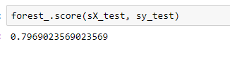

Final testing results gave me a 79.9% Accuracy
# Final Remarks
This project was part of a competition hosted by Taarifa. The goal was to predict as many of the testset water pumps correctly as possible in efforts to improve the Water Crisis in Tanzania. After finishing my models, I used the Random Forest Classifier trained on the SMOTE transformed training data to predict the operating status of the waterpoints on the test set. Dataset and competition can be found at [https://www.drivendata.org/competitions/7/pump-it-up-data-mining-the-water-table/]
